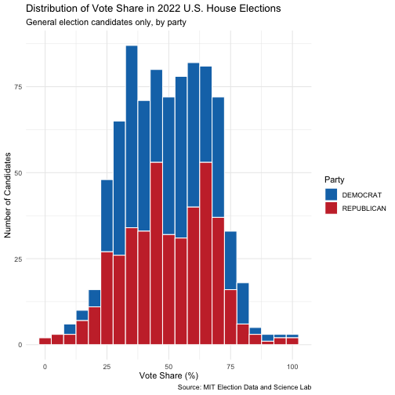

## Project thoughts

I am interested in exploring data related to campaign spending and electoral performance. Basically, I want to investigate if higher campaign spending actually correlates with more electoral success. Using the data from the FEC, I will be able to analyze the relation. Lastly, through data visualization and regression analysis, this project will be able to accurately inform me if campaign spending and electoral performance are positively correlated.


## Milestone #2

Research Question: Does higher spending on campaigns lead to more electoral success in US congressional elections?

Paragraph: To begin, I am going to get my data from the Federal Election Commission (FEC), and I hypothesize that candidates who spend more money on their campaigns end up getting a higher share of votes. I say this because of the resource mobilization theory. This concept refers to the idea that money allows candidates to purchase ads, hire more staff, build name recognition, and conduct voter outreach, which should lead to more votes. Another way of saying this, spending is a resource that pushes better-funded candidates into a more advantageous position, regardless of actual policy/leadership. Secondly, the explanatory variable in this experiment is the total campaign expenditures for each candidate in an election (measured by the FEC). This variable will have a lot of variation for each candidate, ranging from a couple thousand dollars to millions. Third, the outcome variable is the vote share for each candidate. This is measured by the % of total votes received by candidate in their race. Lastly, a pattern that would support my hypothesis would be a statistically significant positive coefficient on campaign spending in a regression of vote share on expenditures. In other words, this means that candidates who spend more, usually win a larger share of votes. On the other hand, my hypothesis would be proven false if the regression shows that there is no statistically significant relationship/negative relationship for spending and vote share. 


## Code for Milestone #2:


``` r
library(tidyverse)
```


``` r
fec_cols <- c("CAND_ID", "CAND_NAME", "CAND_ICI", "PTY_CD", "CAND_PTY_AFFILIATION",
              "TTL_RECEIPTS", "TRANS_FROM_AUTH", "TTL_DISB", "TRANS_TO_AUTH",
              "COH_BOP", "COH_COP", "CAND_CONTRIB", "CAND_LOANS", "OTHER_LOANS",
              "CAND_LOAN_REPAY", "OTHER_LOAN_REPAY", "DEBTS_OWED_BY", "TTL_INDIV_CONTRIB",
              "CAND_OFFICE_ST", "CAND_OFFICE_DISTRICT", "SPEC_ELECTION", "PRIM_ELECTION",
              "RUN_ELECTION", "GEN_ELECTION", "GEN_ELECTION_PRECENT", "OTHER_POL_CMTE_CONTRIB",
              "POL_PTY_CONTRIB", "CVG_END_DT", "INDIV_REFUNDS", "CMTE_REFUNDS")

fec <- read_delim("weball22.txt", delim = "|", col_names = fec_cols,
                  show_col_types = FALSE)

head(fec)
```

```
## # A tibble: 6 × 30
##   CAND_ID   CAND_NAME   CAND_ICI PTY_CD CAND_PTY_AFFILIATION TTL_RECEIPTS TRANS_FROM_AUTH TTL_DISB TRANS_TO_AUTH COH_BOP COH_COP
##   <chr>     <chr>       <chr>     <dbl> <chr>                       <dbl>           <dbl>    <dbl>         <dbl>   <dbl>   <dbl>
## 1 H2AK00200 CONSTANT, … C             1 DEM                       164638.              0   164638.             0       0      0 
## 2 H2AK01158 PELTOLA, M… I             1 DEM                      7751293.         186868. 7060033.             0       0 691260.
## 3 H2AK01240 WOOL, ADAM… O             1 DEM                        16217.              0    16217.             0       0      0 
## 4 H2AK00218 REVAK, JOS… O             2 REP                       121841               0   121841              0       0      0 
## 5 H2AK00226 PALIN, SAR… O             2 REP                      1971161.         112963. 1924781.             0       0  46380.
## 6 H2AK01059 PURHAM, RA… C             2 REP                         1549.              0     5622.             0     140      0 
## # ℹ 19 more variables: CAND_CONTRIB <dbl>, CAND_LOANS <dbl>, OTHER_LOANS <dbl>, CAND_LOAN_REPAY <dbl>, OTHER_LOAN_REPAY <dbl>,
## #   DEBTS_OWED_BY <dbl>, TTL_INDIV_CONTRIB <dbl>, CAND_OFFICE_ST <chr>, CAND_OFFICE_DISTRICT <chr>, SPEC_ELECTION <lgl>,
## #   PRIM_ELECTION <lgl>, RUN_ELECTION <lgl>, GEN_ELECTION <lgl>, GEN_ELECTION_PRECENT <lgl>, OTHER_POL_CMTE_CONTRIB <dbl>,
## #   POL_PTY_CONTRIB <dbl>, CVG_END_DT <chr>, INDIV_REFUNDS <dbl>, CMTE_REFUNDS <dbl>
```


``` r
mit <- read_csv("1976-2024-house.tab", show_col_types = FALSE)

head(mit)
```

```
## # A tibble: 6 × 20
##    year state   state_po state_fips state_cen state_ic office   district stage runoff special candidate      party writein mode 
##   <dbl> <chr>   <chr>         <dbl>     <dbl>    <dbl> <chr>       <dbl> <chr> <lgl>  <lgl>   <chr>          <chr> <lgl>   <chr>
## 1  1976 ALABAMA AL                1        63       41 US HOUSE        1 GEN   FALSE  FALSE   "BILL DAVENPO… DEMO… FALSE   TOTAL
## 2  1976 ALABAMA AL                1        63       41 US HOUSE        1 GEN   FALSE  FALSE   "JACK EDWARDS" REPU… FALSE   TOTAL
## 3  1976 ALABAMA AL                1        63       41 US HOUSE        1 GEN   FALSE  FALSE   "WRITEIN"      <NA>  TRUE    TOTAL
## 4  1976 ALABAMA AL                1        63       41 US HOUSE        2 GEN   FALSE  FALSE   "J CAROLE KEA… DEMO… FALSE   TOTAL
## 5  1976 ALABAMA AL                1        63       41 US HOUSE        2 GEN   FALSE  FALSE   "WILLIAM L \\… REPU… FALSE   TOTAL
## 6  1976 ALABAMA AL                1        63       41 US HOUSE        2 GEN   FALSE  FALSE   "WRITEIN"      <NA>  TRUE    TOTAL
## # ℹ 5 more variables: candidatevotes <dbl>, totalvotes <dbl>, unofficial <lgl>, version <dbl>, fusion_ticket <lgl>
```

## Milestone #3

## Data Cleaning

``` r
mit_clean <- mit |>
  filter(year == 2022, stage == "GEN") |>
  filter(party %in% c("DEMOCRAT", "REPUBLICAN")) |>
  filter(!is.na(candidatevotes), !is.na(totalvotes)) |>
  mutate(vote_share = (candidatevotes / totalvotes) * 100) |>
  filter(vote_share < 100)
```

---

## Data Visualization

``` r
ggplot(mit_clean, aes(x = vote_share, fill = party)) +
  geom_histogram(binwidth = 5, color = "white") +
  scale_fill_manual(values = c("DEMOCRAT" = "#1375B7", "REPUBLICAN" = "#C93135")) +
  labs(title = "Distribution of Vote Share in 2022 U.S. House Elections",
       subtitle = "General election candidates only, by party",
       x = "Vote Share (%)",
       y = "Number of Candidates",
       fill = "Party",
       caption = "Source: MIT Election Data and Science Lab") +
  theme_minimal()
```



